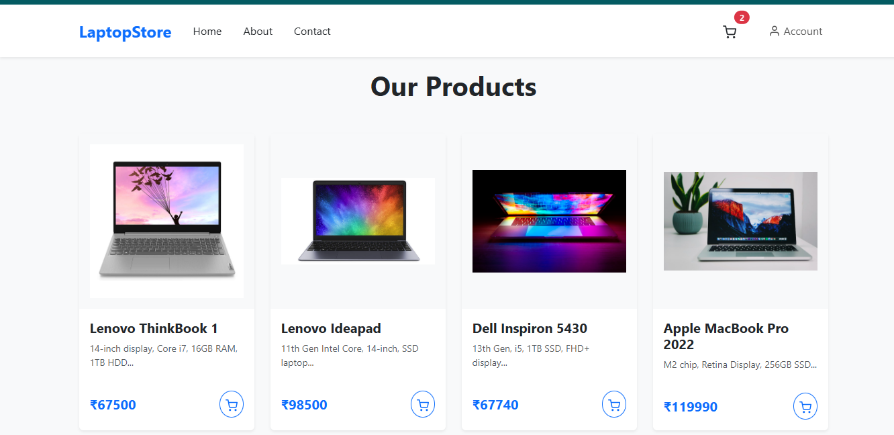
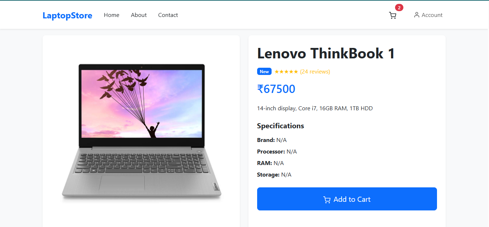
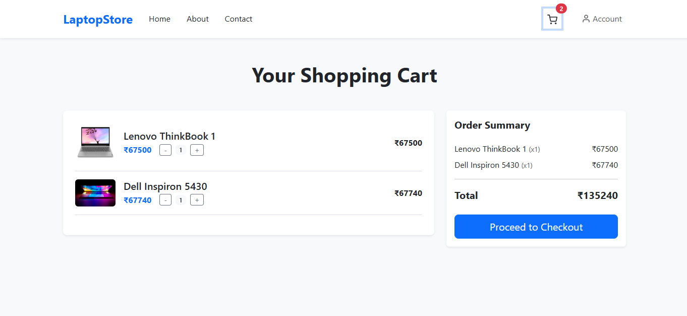
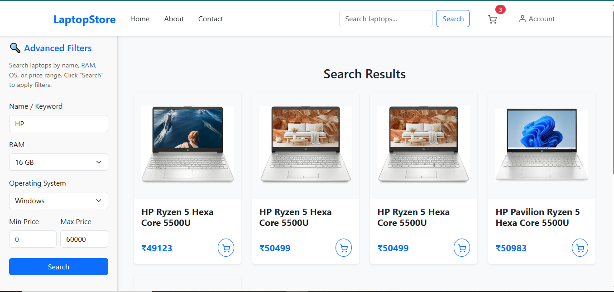
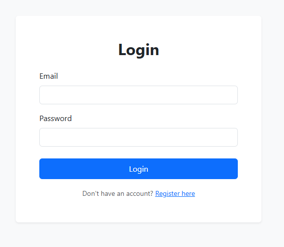
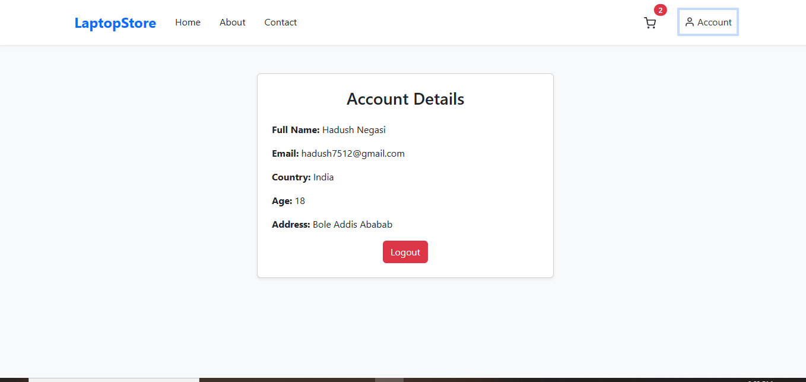

# 🛒 Laptop Store – Full Stack E-Commerce Website

A modern full-stack laptop shopping platform with authentication, cart functionality, and product browsing.

**Built with:**  
✔ **Frontend:** React + Bootstrap + Redux  
✔ **Backend:** Node.js + Express + MongoDB  
✔ **Authentication:** Firebase  
✔ **Deployment:** *(Optional: Add if deployed)*  

---

## 📸 Screenshots

<div align="center">
  
   
  
  
  <br/>
  
  
</div>
---

## 🚀 Features

### 🔐 Authentication
- Secure login/signup with Firebase
- Protected routes & session management

### 🖥️ Product Management
- Browse laptops with filters (price, brand)
- Detailed product view with specs

### 🛒 Shopping Cart
- Add/remove items with quantity control
- Real-time updates using Redux

### 💳 Checkout Flow
- Order summary & mock payment
- Order history in MongoDB

### 📱 Responsive UI
- Mobile-friendly Bootstrap design

---

## 🛠 Tech Stack

| **Category**  | **Technologies** |
|--------------|----------------|
| **Frontend** | React, Redux, Bootstrap, Axios |
| **Backend**  | Node.js, Express, MongoDB |
| **Auth**     | Firebase |
| **API**      | RESTful endpoints |

---

## ⚙️ Setup

### Backend (Node.js + MongoDB)
```bash
cd backend
npm install

Create .env:
MONGO_URI=your_mongodb_connection_string
PORT=5000
FIREBASE_ADMIN_KEY=your_credentials  # Optional
Start server:
node server.js

Frontend (React)
cd frontend
npm install

Add Firebase config in src/firebase.js:
const firebaseConfig = {
  apiKey: "YOUR_API_KEY",
  authDomain: "your-project.firebaseapp.com",
  // ... (from Firebase Console)
};
Run dev server:
npm start

📂 Project Structure
laptop-store/
├── backend/
│   ├── models/       # MongoDB schemas
│   ├── routes/       # API endpoints
│   └── server.js     # Backend entry
│
├── frontend/
│   ├── src/
│   │   ├── components/ # UI components
│   │   ├── pages/      # Views
│   │   └── redux/      # State management
│   └── package.json
│
└── README.md
